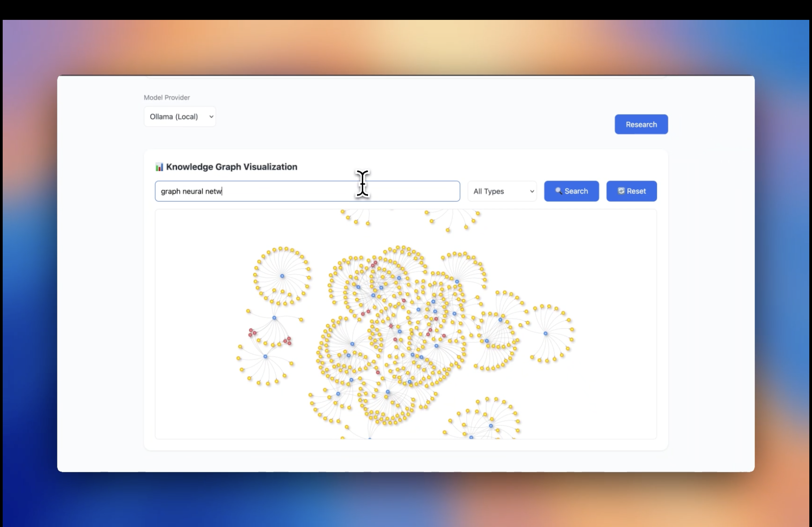

# AI Research Assistant with a Multi-Modal Knowledge Graph

## Overview

This project is a sophisticated AI-powered Research Assistant designed to automate and accelerate the process of exploring complex academic topics. A user can input a research query, and the system leverages a multi-agent backend to find relevant papers, analyze them for key concepts and trends, identify research gaps, and generate new, testable hypotheses.

The application features a clean, modern web interface built with HTML, CSS, and JavaScript, powered by a robust Python backend using FastAPI. It is uniquely designed to support both local, on-premise AI models via Ollama and cloud-based models from OpenAI, giving the user complete control over cost, privacy, and performance.

## Demo

Here's the AI Research Assistant in action:


For a full video demonstration:

[](assets/AIAssistant.mp4)

## Key Features

*   **Hybrid AI Model Support:** Seamlessly switch between local AI models (e.g., Llama 3.1) running via Ollama and powerful cloud-based models (e.g., GPT-4o) via the OpenAI API. This choice is offered to the user directly in the UI for each query.
*   **Multi-Agent System:** The backend employs a `MultiAgentOrchestrator` to coordinate specialized agents, each responsible for a different phase of the research workflow:
    *   **Paper Ingestion & Analysis:** Fetches academic papers from arXiv and uses an AI model to analyze trends and key talking points.
    *   **Knowledge Graph Construction:** Extracts key concepts from papers and is designed to build a knowledge graph in a Neo4j database, mapping the relationships between papers, concepts, and authors.
    *   **Research Gap Identification:** Analyzes the knowledge graph to find underexplored concepts, highlighting potential areas for novel research.
    *   **Hypothesis Generation:** Synthesizes all the collected data and analysis to generate new, insightful, and testable research hypotheses.
*   **Interactive Knowledge Graph Visualization:**
    *   **Dynamic Graph Display:** Real-time visualization of the knowledge graph using vis.js
    *   **Advanced Search:** Search nodes by type (Papers, Concepts, Authors, Methods) and content
    *   **Interactive Navigation:** Zoom, pan, and focus on specific nodes
    *   **Node Highlighting:** Automatic highlighting of search results
    *   **Type-based Coloring:** Different colors for different node types
*   **Modern Web Interface:**
    *   **Clean Design:** Minimalistic and intuitive user interface
    *   **Responsive Layout:** Works seamlessly on desktop and mobile devices
    *   **Real-time Updates:** Dynamic content updates without page reloads
    *   **Interactive Components:** Rich user interactions with immediate feedback
*   **Containerized & Reproducible:** The entire application stack, including the Neo4j database and the Python environment, is containerized using Docker and Docker Compose, ensuring easy setup and consistent operation across different environments.

## Technical Architecture & Tech Stack

The system follows a modern client-server architecture.

1.  **Frontend (Client):** A user submits a research query through the web interface. The UI also allows selecting the AI provider (Ollama or OpenAI).
2.  **Request:** The frontend sends a POST request to the `/research` endpoint on the backend.
3.  **Backend (Server):**
    *   The **FastAPI** application receives the request.
    *   A `MultiAgentOrchestrator` is initialized with the selected AI model manager (`LocalModelManager` or `OpenAIModelManager`).
    *   The orchestrator executes the research workflow, calling agents in sequence.
    *   Data is fetched from **arXiv** and analyzed by the selected AI models.
    *   Key information is structured for storage in a **Neo4j** graph database.
    *   The final, consolidated results are packaged into a single JSON object.
4.  **Response:** The JSON object is sent back to the client.
5.  **UI Update:** The frontend uses the data from the JSON response to update all relevant components on the dashboard, displaying the complete research analysis to the user.

### Tech Stack

*   **Backend:** Python, FastAPI, Uvicorn
*   **AI & Machine Learning:**
    *   **Local:** Ollama (Llama 3.1, CodeLlama, Nomic Embeddings)
    *   **Cloud:** OpenAI API (GPT-4o)
    *   **Embeddings:** Sentence-Transformers
*   **Database:** Neo4j (Graph Database)
*   **Frontend:** HTML5, CSS3, JavaScript, Vis.js, TailwindCSS
*   **DevOps & Tooling:** Docker, Docker Compose

## How to Run the Project

### Prerequisites
*   Docker and Docker Compose
*   Python 3.8+
*   An internet connection to download models and dependencies.

### Setup Instructions

1.  **Clone the Repository:**
    ```bash
    git clone <your-repository-url>
    cd <your-repository-directory>
    ```

2.  **Configure Environment Variables:**
    Create a `.env` file in the project root. This file will store your OpenAI API key, which is required if you want to use the cloud-based models.
    ```
    # .env
    OPENAI_API_KEY="your_openai_api_key_here"
    MODEL_PROVIDER="local" # or "openai"
    
    # Neo4j Credentials (if not using defaults)
    NEO4J_URI="bolt://localhost:7687"
    NEO4J_USER="neo4j"
    NEO4J_PASSWORD="research123"
    ```

3.  **Build and Run with Docker Compose:**
    This is the recommended method. It will start the FastAPI backend, the Neo4j database, and pull the required Ollama models.
    ```bash
    docker-compose up --build
    ```
    On the first run, this may take some time as it will download container images and the local AI models.

4.  **Access the Application:**
    Once the containers are running, you can access:
    *   **The Main Application UI:** `http://localhost:8000`
    *   **The Backend API Docs:** `http://localhost:8000/docs`

## Future Work

*   **Enhanced Graph Analytics:** Implement more advanced graph algorithms for deeper relationship analysis
*   **More Data Sources:** Integrate more academic search engines beyond arXiv, such as PubMed, IEEE Xplore, or Google Scholar
*   **User Accounts & History:** Implement user authentication to allow users to save and revisit their research history
*   **Collaborative Features:** Add support for shared research spaces and collaborative analysis
*   **Export & Integration:** Add support for exporting research findings to various formats and integrating with other research tools